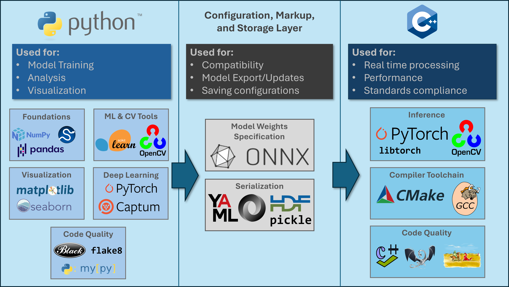

# Guidelines for Academic Machine Learning Projects Aimed at Transition to Production Environments

This repository provides guidelines and best practices for academic machine learning (ML) projects aimed at transitioning to a production environment. The guidelines are intended to cover and apply to a broad span of ML methods and a similarly broad span of applications, with in-depth focus on deep learning enabled perception methods, i.e., methods for using deep neural networks for detecting, classifying, and keeping track of patterns in data. These guidelines are intended to help ML researchers and researchers applying ML to their fields design ML components in a manner which facilitates later developing and deploying robust systems which perform reliably on constantly changing real world data. These guidelines provide technical background, software best practices, machine learning best practices, and research guidance to this end. ML best practices covered include project planning, requirements formulation, ethics evaluation, recommendations for team building and budgeting, data pipeline practices, considerations for how sensors can affect data, model architecture selection techniques, hyper-parameter tuning techniques, recommendations for robustness, hardening, red-teaming, post-training scaling, and other evaluation steps. This guide is aimed at ML researchers interested in performing their research in a manner which will facilitate rapid transition to production environments, and practitioners in other fields researching applications of ML in their respective fields.

## 1. Introduction

### 1.1. Who Should Read this Guide

This guide is mainly targeted for advanced undergraduate students and beginning graduate students researching ML applications and interested in conducting their research in a manner which will facilitate later transition of the research to a production environment, i.e., an environment where the outcomes of ML models are visible to real world users or making an impact on real world users in some way. This target audience includes ML researchers and researchers in other fields applying ML to their fields. This guide assumes that readers are already familiar with ML basics and ML theory relevant to their projects and does not attempt to cover these topics. Readers are deferred to classical texts to cover ML basics and theory. While the guide is aimed at use by advanced undergraduate and beginning graduate students in guiding academic projects, it may be useful to any readers conducting ML research or design work and interested in following responsible practices in doing so. To avoid slowing down research by imposing all of the constraints and rigor of designing and deploying a production-grade ML system prematurely, this guide focuses on preparing ML research that is *ready for* expedited transition to production, rather than *immediate* deployment of production grade systems, which can have widely varying requirements across applications.

TODO: Cite classical ML texts

### 1.2. Pre-requisites

Readers of this guide should already be comfortable with the mathematical fundamentals behind modern ML, specifically those that underpin deep learning, including linear algebra, correlation, model fitting, optimization, and numerical methods. It is assumed readers are already proficient in Python and know how to set up local and remote Python development environments. Prior familiarity with tools including scikit-learn, torch, torch lightning, thunder, pandas, matplotlib, numpy, cupy, Open Neural Network Exchange (ONNX) is assumed but not strictly required to understand the guide. Examples of some of these tools are provided. Ability to quickly learn how to use tools such as Captum (neural network explainability), Lime (general explainability), and the Adversarial Robustness Toolkit (ART). Familiarity with software basics including version control, setting up an integrated development environment (IDE), coding, and programming language basics is fully assumed and these are not covered in this guide.

### 1.3. Motivation

Due to the relatively recent prevalence of artificial intelligence (AI) systems, we often hear of the significant impacts (both positive and negative) that the technology will have on our daily lives, and on broader societies. Familiar products, such as cell-phones and cars, are being augmented with AI capabilities, and AI is increasingly being used in critical industries, such as medicine and national defense. However, the tendency for prominent AI techniques to produce the correct answers for the wrong reasons still presents significant risks. For example, the use of AI in self-driving vehicles has brought many philosophical questions once confined to the classroom (such as the famous trolley problem in ethics) to the heart of engineering design discussions for the specialists who design these systems. Issues with all-weather sensor reliability, once a goal more important for military applications than civilian applications, now make headlines as self-driving cars must accurately discriminate people, objects, and other vehicles, despite challenging weather conditions such as rain, fog, and changes in lighting.

Similar to other technological advances that impacted critical applications, such as the prevalence of software in modern devices (even those we do not typically think of as computers), the invention of new modes of travel (e.g., sea and air travel), and even the use of electricity itself, the maturation of AI from a field of experimental study to a mature practice suitable for real-world deployment requires AI practitioners adopt and implement a repertoire of safeguards to protect the users impacted by these deployments. Practitioners need to adopt these safeguards both proactively, to prevent foreseen incidents involving AI technology, and reactively, to ensure lessons learned from previous implementations are not forgotten. The [AI Incident Database](https://incidentdatabase.ai/) maintains a growing list of incidents in which AI systems deployed to the real world have caused harms to individuals, groups, and societies. The incidents documented range from annoyances for users of systems, to harmful injustices, and tragic outcomes with injuries and lives lost.

This guide aims to help student researchers conduct ML research responsibly, with the impacts that future productionization of the technology they are developing will have on future users and broader societies in mind. Software best practices covered are intended to help students who may not be familiar with production coding practices write code in a way the maximizes maintainability and expedites transition to productions without taking the full time and effort required to implement a production grade system prematurely. Project planning, requirements formulation, team building, and budgeting guidance is provided to help students who might be used to being assigned a problem make the transition to selecting and formulating a problem to solve, and collaborating with others to solve it with an idea in mind of how much resources might be required to do so. Ethics evaluation guidance helps students evaluate if their use case is appropriate for ML techniques. Data pipeline practices and considerations for how sensors can affect data are provided to help students move from employing pre-labeled classical ML datasets to using messier data found in the wild. Model architecture selection techniques and hyper-parameter tuning are covered along with recommendations for robustness testing, hardening, and red-teaming are covered to help students move beyond checking model accuracy and ensure the models are robust to real world data diversity and drift.

### 1.4. Nomenclature

In this guide, we distinguish between *Requirements*, *Best Practices*, *Recommendations*, and *Techniques*.

* *Requirements* are hard requirements which all ML research aimed at production transition must follow.
* *Best Practices* are strong recommendations which practitioners should have a good reason for deviating from. Any deviation from a best practice must come with an explanation.
* *Recommendations* are suggestions that can be deviated from for equal alternatives.
* *Techniques* are steps in the ML process which require judgement in application. Techniques may be helpful or even critical for some problems but unhelpful in others. Data augmentation is an example of a technique which may be critical in some cases but not applicable to all problems and liable to cause worse results if applied inappropriately.

*Anti-patterns* (i.e., what NOT to do) are also reviewed at the end of this guide.

## 2. Software Tools and Practices

### 2.1. Recommended Toolchain and Architecture

While beginning research projects might be confined to a Jupyter notebook or a small number of Python scripts, ML research projects ready for transition to production need to employ an ecosystem of tools at various stages of the development cycle. An example production workflow is outlined below. While there are many options, and many production ML projects use different tools (e.g., PyTorch and TensorFlow) the general idea is the same: decouple training and inference software when possible. Adopting some of this workflow early can help academic ML research transition to production faster.

<div align="center">

<h4>Typical toolchain for production machine learning workflows.</h4>
</div>

#### Requirement: Decouple training and inference code.

For systems that do not need to learn online, it is helpful to decouple training and inference software. Training and inference software often must meet different requirements, and may even be developed by different teams with different skills on different systems in production settings. It also might be necessary to train a model once and then deploy to multiple different production environments. In the example above, we see a common workflow where training is performed in Python, then models and data are serialized for export to a production system where inference is performed in C++. As a compiled language, well-written C++ can make better use of system resources and ensure timing and memory requirements are met. Even if runtime and memory benefits are small, they are compounded when an application is hosted many times.

As an interpreted language, Python is faster to develop in and its host of packages facilitate machine learning development. Decoupling enables the developers or teams of developers maintaining both sides of the workflow (training and production) to optimize their components for their respective requirements. A decoupled workflow is one where changes to each column require minimal or ideally no changes to the others. Systems which implement online learning will have tighter coupling between training and inference (for example, both will be implemented in the production system) but should still be modular such that changes to modules pertaining to training (e.g., the loss function) do not impact changes to modules pertaining to inference.

#### Recommendation: Use Python for training and analysis software.

It is recommended to implement training software in Python. Python is commonly used for ML training, analysis, and visualization. Python is a *Duck-typed* language which means variables are typed according to data passed to them.  Python is an interpreted language, which means programs can run immediately without being compiled. This is convenient for programmers but can result in slower code for some tasks. Python's interpreter will compile it after first run, however, it is still primarily a scripting language, meaning it is focused on automating tasks rather than optimizing for performance by allowing direct manipulation of the computer's hardware (though some Python code can run very fast).

The following training side tools are recommended:
* `numpy` for matrix manipulation
* `scipy` for scientific computing
* `pandas` for data management
* `matplotlib` for basic plotting with a high degree of customization
* `seaborn` for more advanced plotting
* `scikit-learn` for training machine learning models (e.g., random forest, support vector machine, small neural networks)
* `opencv` for computer vision
* `pytorch` for deep learning, including reinforcement learning, convolutional neural networks, transformers, and other modern architectures
* `captum` for neural network explainability
* `lime` for model agnostic explainability
* `adversarial-robustness-toolbox` for model hardening
* `black` for Python code auto-formatting
* `flake8` for Python code linting
* `mypy` for Python code type-checking

Many other tools are possible and there are many tool choices available (e.g., PyTorch vs. TensorFlow). This list just provides a starting point.

#### Requirement: Serialize models with a secure format.

While storing model weights as pickle files is convenient for prototyping, pickle files are not secure or suitable for production systems. Proper model serialization ensures secure model storage, compatibility between projects (if there is a need to share models), and compatibility between training and inference decoupled from a particular programming language. ML research aimed at production transition must export model weights as Open Neural Network Exchange (ONNX) files to meet these goals. ONNX emerged as the standard serialization format for deep learning and has growing support for other machine learning architectures from scikit-learn. This allows exporting models to a standard format such that any project can read them, and acts as a boundary layer between training and inference.

#### Requirement: Serialize and save experiment parameters to ensure repeatability.

To ensure training pipelines are repeatable, any parameters set by the engineer performing training experiments must be serialized using a format such as YAML or JSON, and saved. This is especially important as production data pipelines and models are highly configurable with many parameters. Saving these parameters ensures the training pipeline is repeatable and provides a record of tuning performed, preventing developers from asking *"what did I set the learning rate to again?"* when trying to repeat an experiment. There are many tools for ML experiment tracking available for free and commercially, but at minimum projects must save experiment parameters so they are repeatable. This includes seed values for random number generators, hyperparameters tuned, and parameters related to pre- and post-processing employed.

#### Requirement: Serialize configuration parameters separately from model files.

If there are additional configuration parameters which are output by the training pipeline and loaded by the inference pipeline, these must be serialized separately from the model. For example, hyperparameters related to post-processing (e.g., number of model decisions to count before showing a result to the user) must be decoupled from the model in case they must be changed later on.

#### Recommendation: Use C++ for inference software (or another language which meets the requirements of the production system).

This recommendation comes with the emphasis to select a language that meets the requirements of the production system. C++ is a good default recommendation since code written in C++ can be optimized for performance (with the caveat that skilled developers must be available) and can be compiled on most systems. Some inference environments (e.g., vehicles) may come with strict timing constraints, and others (e.g., large scale simulation where many instances of a software module are invoked) might come with memory constraints. These all motivate optimizing for requirements that might be overly constraining in training time. Other requirements, such as policy, team availability, and precedents might also drive selection of inference programming language. Critically, as long as training and inference software are decoupled, the language for training can be selected with consideration for the training system requirements.

#### Requirement: Extend PyTorch's model class (or another suitable base class) for model definitions.

Models should be interchangeable between training and inference, and interchangeable between training frameworks. To minimize duplicate code and ensure models conform to a standard interface, models in the training framework must inherit from a common base class. If using PyTorch, this base class is provided (e.g., through `torch.nn.Module`). If using another framework, or a custom framework, ensure models inherit from a base class which guarantees that they are interchangeable.

#### Requirement: Extend PyTorch's Dataset class for data loading (or implement another suitable means for data loading and transformation management).

When loading small datasets for simple problems, it is feasible to load the entire dataset into memory at once. When working with larger datasets in production environments, however, it is required to manage how much data is loaded at a given time. Further, production scale datasets might need to be transformed in several ways before each training run. Since the transforms are numerous and relatively inexpensive computationally compared to training the neural network, it is often preferred to apply them dynamically as data is loaded rather than applying them to the entire dataset and saving the result. If using PyTorch, the `Dataset` and `DataLoader` classes implement this functionality. If using another framework or a custom framework, it is required to implement suitable data loading and transformation management functionality.

#### Technique: Choose between functional and class member model fit function architectures deliberately.

Two design paradigms are common for implementing ML training frameworks. The first is the `.fit()` / `.predict()` paradigm implemented by libraries like `scikit-learn`. Under this paradigm, the model fitting function is a member of the model class. The second is the paradigm common in many `torch` examples, where training is thought of as a function which operates on the model class or its weights, which need not be a member of the model class. Both are valid design options that give user code different means of interacting with the library to train models for production, and have have advantages and disadvantages which might make them more or less suitable for different situations. In general, choose to make the training function a member of the model class if the training function is coupled to the model. Make the training function standalone if it is a general implementation of a training pipeline that applies to a broad range of models. If in the context of a design, it makes more sense to say the model *has a* trainer, make the training function a member of the model class. If it makes more sense to say a training *operates on* a model, make the training function standalone. If the training function *is an* instance of a broader trainer, making it inherit from a parent trainer class but not from a common parent with the model.

Making the training function a member of the model class couples that function to the model class. Select this option if future developers would be expected to want to modify the training function when the model is modified. This is useful if the training function is specific to the model (i.e., it would not make sense to use the training function for a different type of model). Users of `scikit-learn` might also find this approach more intuitive. A practical benefit of this approach is that user code need only import the class to gain access to the training function. If the training function is specific to the model, this forces developers to consider changing the training function when the model is changed since the training function now lives close to the model specification code.

The tradeoffs of this approach are that the training function is now coupled to the model, making it difficult to reuse. The complexity of the model class also increases, which can decrease the maintainability of the model class by creating more functions and variables to keep track of compared to a cleaner class implemented in smaller portions. These tradeoffs can be mitigated by implementing the training function as a member of a parent class and inheriting it, but implementing the inheritance structure itself can complicate code further if not done well.

Making the training function a standalone function or a member of a class (e.g., a "Trainer" class) that does not inherit from a common parent with the model decoupled the trainer from the model. Select this option if the training process is general and can apply to multiple models. In large systems, it might even be appropriate to build a training pipeline in a separate repository and push multiple different types of models through the pipeline. Some systems may even warrant multiple training pipeline steps to be developed in separately by different teams. Since many training steps are general, and since there are many steps in training production models, it is complicated to implement them all as members of the model class without bloating it or adopting a complex inheritance structure.

The main benefit of this approach is that the training function decoupled from the model. Note that this is only a benefit if the training function is actually general. If the training function is specific to the model but decoupled, developers might not remember to change one when changing the other, and the class member paradigm is more appropriate. An additional practical benefit is that user code is not forced to inherit the dependencies of the training function when importing the model class. This benefit can be significant if the training routine has a complex list of dependencies.

The first main tradeoffs of separating training into a function is that developers must take care not to implement any functionality in the training function that is specific to a particular model. If the training function becomes model specific, the architecture will need a way to keep track of what models it can process, which may increase complexity. Note that specific is relevant to the breadth of models the overall design must support. It is unlikely any design will be able to provide a universal trainer for all possible models. Assess whether or not a trainer is model specific by determining if it can support all the models the design must support, rather than all possible models. A practical trade off is that users might need to import more components to train a model. This is undesirable if the goal is friendly user code for ease of use, but desirable for production systems where user code should be able to explicitly import what is needed.

### 2.2. Software Hygiene

#### Section Acknowledgements

Special thanks to my colleague, Rob Shemeley, for providing these tips which encapsulate decades of software engineering wisdom and leadership into a helpful set of tips.

#### Requirement: Use a style guide.

Formatting code manually wastes valuable time that would be better spent writing code. Further, everyone on a team will have different opinions about how code should be formatted. This leads to differing formats on projects worked on by multiple people and time lost to debates about formatting. Avoid this and get back time writing the core code and functionality by running autoformatters.

Two great autoformatter tools are `black` and `isort`. They can be installed with pip.

```bash
pip install black
pip install isort
```

A quick tutorial on using these in VSCode can be found at [https://code.visualstudio.com/docs/python/formatting](https://code.visualstudio.com/docs/python/formatting).

To get them setup in VSCode install them as extensions (following the linked tutorial).

Example VS Code settings to use `black` and `isort` to format code on save:

```json
    "[python]": {
        "editor.defaultFormatter": "ms-python.black-formatter",
        "editor.formatOnSave": true,
        "editor.codeActionsOnSave": {
            "source.organizeImports": true
        },
    },
    "black-formatter.args": [
        "--line-length",
        "79"
    ],
    "isort.args": [
        "--profile",
        "black"
    ],
    "notebook.formatOnSave.enabled": true,
```

#### Requirement: Write high quality commit messages.

Remember that commit messages are a log of the work done on a project. The commit messages should be descriptive so developers can return to a previous version and know which version they are returning to.

Avoid non-descriptive commit messages like "stuff" or "wip". This is unprofessional and forces the team to do extra work to figure out what was meant by these non-descriptive messages.

Bad:

```bash
git commit -m "stuff"
```

Good:
```bash
git commit -m "Add the unit conversion module"
```

A good commit message is grammatically correct and should read as "When applied, this commit will...".

The good commit message above would read as "When applied, this commit will add the unit conversion module".

#### Requirement: Use well thought-out, descriptive variable and function names.

Variable and function names should be well thought-out and should ideally make code read almost like english. A good rule is to make function names verbs (since the functions execute an action) and make variables names nouns since they define data. It also helps to add units to variable names to help keep track of them (if not using another solution to keep track of units). See below for good and bad variable name examples.

```python
# Bad:
zz = 2
counter = 0
eval_flag = True

# Good:
z_measured_altitude_meters = 2
page_visits_counter = 0
# Avoid using flags; they are difficult to test!
```

#### Requirement: Do not commit dead code.

Do not keep dead code in a system. Dead code is code that is commented out or otherwise unused. Examples of dead code include commented out code and code that is intentionally designed to not run.

An example of dead code is below. These two lines of code look very similar. Why is one commented out another not commented out? This might have been clear to the original developer but will not be clear to future developers. What are the consequences of using the old model of the system instead of the new model? Someone might be tempted in the future to find out by uncommenting the second assignment. If this is an out of date model, then this could lead to harmful consequences.

```python
x_input = 2
system_output = 2 * x_input**2 + 4 * x_input + 1
# Old system output
# system_output = 3 * x_input ** 2 + 4 * x_input + 2
```

The following example of flagged out code is just as bad as the example with commented out code (and in some cases can be worse). When should future developers change the `use_old_system_model` flag? Is the line covered by that flag tested? Is it ok to change the flag to true? Since the flag is set to `False` no tests will cover that line.

```python
x_input = 2
system_output = 2 * x_input**2 + 4 * x_input + 1
use_old_system_model = False
if use_old_system_model:
    system_output = 3 * x_input**2 + 4 * x_input + 2
```

Remember that code is a liability. It is desirable to have as little code in a system as possible because every line of code written presents extra risk for error and costs more for future teammates (or your future self) to read and maintain. Commenting out lines of code can be helpful for local debugging or trying ideas. Never push this kind of mess to git for teammates or your future self to deal with though! Use git branches to formally try out multiple ideas complex enough to commit to version control.

#### Requirement: Write high quality code in Python and call from Jupyter notebooks (rather than developing inside notebooks).

Notebooks are useful for seeing results of code inline with the code, for explaining ideas with styled markdown next to code, and for keeping plots close to the code that generated them (some which Tufte, the author of the famous Visual Display of Quantitative Information, would appreciate).

Jupyter notebooks are also useful for working on code where it is helpful to run blocks of the code out of order, or helpful to run some blocks of code several times before proceeding to the next blocks. Jupyter is a popular tool for training and testing machine learning models for this reason. A first set of cells in a machine learning notebook might unpack data. These cells might be run multiple times until the data scientist is sure the data is extracted correctly. A next set of cells might then train a model from the data to make inferences on new data, providing some metrics on the model after each training run. The data scientist might then repeat these cells multiple times until the metrics are satisfactory before proceeding with testing the model on held out data.

These are all excellent use cases for Jupyter. However, developing complex algorithms and systems directly in Jupyter notebooks must be avoided. This is because the ability to run cells out of order can cause unexpected errors. For example, if an algorithm spans multiple cells in a notebook, a user might run the first cells after running some middle cells and before running the end cell. This can cause unexpected results. This can be especially dangerous when running cells out of order causes the result in the final cell to be correct for the wrong reason. Then someone might think the code works, push it so a teammates can use it, and then realize they cannot reproduce the original results!

It is tempting to keep all the code for a single algorithm in a single Jupyter cell to solve this problem. This will introduce other problems for maintainability though. Code (like prose) is easier to read and digest in small blocks. Having code grouped together just to control how your teammates can and cannot execute it in Jupyter is a misuse of Jupyter's cells and will cause teammates to have to read and digest unnecessarily large blocks of code which is burdensome and time consuming.

The way to solve this problem is to develop code inside importable, self-contained Python modules (individual files) or Python packages (folders structured as importable libraries in Python). Breaking code into separate files can be helpful for all of the following reasons.

* Breaking code into separate files ensures that Jupyter notebook cell execution order will not corrupt variable states, without making cells too long.
* Each file is independently testable and once determined to be working does not need to be touched again.
* Each file can handle a single responsibility (do one thing and one thing well) so that the team knows exactly where to look if a part of the system or analysis tools are not functioning correctly.
* When collaborating with teammates, it will be easier to divide work between files and avoid conflicts when merging with git by working on separate files.
* When working on complex projects across multiple organizations, it is easier to determine what organization is responsible for the code in each file.

#### Requirement: Write high quality documentation in comments or notebooks.

If writing a notebook, be sure to explain plots, derive any key equations, and keep plots close to their explanations and related concepts. If writing a Python script, be sure to include comments. At minimum, include comments at the top of the script stating its purpose, how to use it, and any known issues. For Python modules, use docstrings for each module, function, and class. Adhere to a standard, like the Google Style Guide to make your docstrings consistent. Always make a descriptive README file for any project or repository you create.

#### Technique: Deciding what lines are worth commenting.

For any lines that would look surprising to a teammate, explain those with a specific comment. Keep in mind that any time you are writing a comment that explains how your code works, you are probably writing code that is too surprising! Strive to write simpler code that will be self documenting, using variable names, function names, and the structure of the code to make it read like prose. Save comments to explain why you did something, and let the code itself explain how you did it.

With all documentation, write as if writing to a teammate or a future version of yourself needing to pick up the project after forgetting about its details and being busy with other projects. Try to momentarily "switch off" thoughts deeply involved in the code at-hand and look at it with fresh eyes. If it wouldn't make sense now without having stared at it for a few hours, it will not make sense to you in a few months! Be kind to yourself and explain it in the code.

Remember that the further documentation is away from your code, plots, and any data analyzed in the project, the more likely it will be to get out of date. Keep documentation close to the information it is documenting so when that information changes the team will notice the discrepancy and change it.

For any code in a project ready for production transition, it is immediately obvious to anyone on the team (and to anyone who has to run that code) what it does and how to use it. This seems obvious for small projects, but is not always obvious for big projects. A common pitfall in professional settings is for different teams to develop projects that other teams besides their own cannot run. This might be due to undocumented dependencies, writing surprising or unusual code not adhering to the idioms of the language, or simply a complete lack of any documentation.

Complete documentation should explain all of the following.

* What does the software do?
* How can a new user run the software?
* What dependencies are required to run the software?
* Is any development environment set up required?

#### Requirement: Write unit tests.

In production environments, it is common to practice test driven development (TDD) where code may not be written unless a test has been written first. Then, only the minimum code required to make the test pass may be written. This practice is essential to ensuring that code meets requirements and that unneeded costs and liabilities are not incurred due to extra code being written. The recommended unit test frameworks in Python are `unittest` and `pytest`. If code does not have unit tests, it is not considered maintainable since there is no way to check it is performing as intended once changing it. Additional tests can be employed to ensure that a system functions correctly as a whole, that parts of a system interface correctly with each other, and that a system meets formal requirements specified by a customer.

Unit tests are required for any systems transitioning to production. In research projects, however, it is often difficult or counter-productive to implement TDD prematurely. Often, requirements are not defined yet, meaning it is not possible to write a unit test that is failing. Instead of adopting TDD prematurely, consider options such as first designing a prototype of a system, then implementing a new version using TDD before transition to production. Consider also performing development for system components that do have firm requirements using TDD, and only implementing the parts of the project without firm requirements without tests in the early stage.

#### Further Reading

Many of these tips are inspired by the famous Clean Code book by Robert C. Martin. This book is excellent further reading, and essential reading if developing software professionally.

ML research in Python should strive to write code that is idiomatic for the Python language. Suggestions for further reading on Python include:
* The [PEP 8 Style Guide](https://peps.python.org/pep-0008/)
* Python's tour of the standard library [part I](https://docs.python.org/3/tutorial/stdlib.html) and [part 2](https://docs.python.org/3/tutorial/stdlib2.html)
* Collection of Python resources: [https://docs.python.org/3/tutorial/whatnow.html](https://docs.python.org/3/tutorial/whatnow.html)
* The Zen of Python (`python -c "import this"`)

### 2.3. Repository Structure

#### Requirement: Employ a standard repository structure.

ML research ready for production transition must employ a repository structure idiomatic for the language(s) being used. An example repository structure for a Python project is below.

* `.devcontainer` - This is the development container. It is recommended to use a pre-existing development container (such as an Nvidia Deep Learning Container).
* `projectname` - This is the name of the Python package. Project modules go in this folder.
* `notebooks` - Notebooks must be separate from the main project code. Notebooks must import packages from `projectname` rather than including large blocks of code.
* `tests` - This is where unit tests go. Unit tests are required in production code.
* `.gitignore` - This file tells Git which files to ignore.
* `LICENSE` - The license file for the project.
* `poetry.lock` - This file defines the working configuration of Python packages that Poetry solved for and should be committed with the repository.
* `pyproject.toml` - This file is generated by Poetry when a new project is started. It defines the packages and versions thereof that the project uses.
* `README.md` - This is the README file.

Inside the `projectname` folder, employ standard Python conventions for directory structure. For example:

```text
packagename/
    subpackagename/
        __init__.py
        subpackagemodule.py
    __init__.py
    module.py
```

### 2.4. Evaluation of New Tools

https://github.com/ruc-practical-ai/fall-2024-class-06/blob/main/notebooks/01_image_sensor_modeling_with_pybsm.ipynb

### 2.5. Collection of Examples

#### 2.5.1. Basic Python Packages
https://github.com/ruc-practical-ai/fall-2024-class-03/blob/main/basic_packages_introduction/01_numpy.ipynb
https://github.com/ruc-practical-ai/fall-2024-class-03/blob/main/basic_packages_introduction/02_pandas.ipynb
https://github.com/ruc-practical-ai/fall-2024-class-03/blob/main/basic_packages_introduction/03_pandas_plots.ipynb
https://github.com/ruc-practical-ai/fall-2024-class-03/blob/main/basic_packages_introduction/04_matplotlib_plots.ipynb
https://github.com/ruc-practical-ai/fall-2024-class-03/blob/main/basic_packages_introduction/05_matplotlib_widgets.ipynb

#### 2.5.2. ML Packages
https://github.com/ruc-practical-ai/fall-2024-class-03/blob/main/ml_packages_introduction/01_intro_to_scikit_regression.ipynb
https://github.com/ruc-practical-ai/fall-2024-class-03/blob/main/ml_packages_introduction/02_intro_to_scikit_classification.ipynb
https://github.com/ruc-practical-ai/fall-2024-class-03/blob/main/ml_packages_introduction/03_clustering_with_scikit.ipynb
https://github.com/ruc-practical-ai/fall-2024-class-03/blob/main/ml_packages_introduction/04_pytorch_introduction.ipynb
https://github.com/ruc-practical-ai/fall-2024-class-03/blob/main/ml_packages_introduction/05_pytorch_autoencoder_example.ipynb

#### 2.5.3. PyTorch Examples
https://github.com/ruc-practical-ai/fall-2024-class-05/blob/main/notebooks/00_dataloading.ipynb
https://github.com/ruc-practical-ai/fall-2024-class-05/blob/main/notebooks/01_torch_transforms.ipynb
https://github.com/ruc-practical-ai/fall-2024-class-05/blob/main/notebooks/02_model_explainability_with_captum.ipynb
https://github.com/ruc-practical-ai/fall-2024-class-05/blob/main/notebooks/03_model_saving_with_onnx.ipynb
https://github.com/ruc-practical-ai/fall-2024-class-05/blob/main/notebooks/04_visualizing_models.ipynb

## 3. ML Requirements, Best Practices, and Techniques

### 3.1. Project Planning
https://github.com/ruc-practical-ai/fall-2024-final-project/blob/main/INSTRUCTIONS.md

### 3.2. Selecting a Use Case and Formulating Requirements

### 3.3. Ethics Evaluation

### 3.4. Building a Team

### 3.5. Budgeting

### 3.6. Basic ML Practices

Class 04

### 3.7. Data Pipeline
https://github.com/ruc-practical-ai/fall-2024-final-project/blob/main/INSTRUCTIONS.md

### 3.8. Understanding Your Sensor

Class 06

https://github.com/ruc-practical-ai/fall-2024-class-06/blob/main/notebooks/01_image_sensor_modeling_with_pybsm.ipynb

https://github.com/ruc-practical-ai/fall-2024-class-06/blob/main/notebooks/02_more_pybsm_examples.ipynb

https://github.com/ruc-practical-ai/fall-2024-final-project/blob/main/INSTRUCTIONS.md

### 3.9. Architecture Selection
https://github.com/ruc-practical-ai/fall-2024-final-project/blob/main/INSTRUCTIONS.md

### 3.10. Model Training
https://github.com/ruc-practical-ai/fall-2024-final-project/blob/main/INSTRUCTIONS.md

### 3.11. Hyperparameter Tuning
https://github.com/ruc-practical-ai/fall-2024-final-project/blob/main/INSTRUCTIONS.md

### 3.12. Early Productionization

Class 07

### 3.13. Robustness and Hardening
https://github.com/ruc-practical-ai/fall-2024-final-project/blob/main/INSTRUCTIONS.md

### 3.14. Post-Training Scaling
https://github.com/ruc-practical-ai/fall-2024-final-project/blob/main/INSTRUCTIONS.md

### 3.15. Red-Teaming
https://github.com/ruc-practical-ai/fall-2024-final-project/blob/main/INSTRUCTIONS.md

### 3.16. Test and Evaluation
https://github.com/ruc-practical-ai/fall-2024-final-project/blob/main/INSTRUCTIONS.md


## 4. Research Guidance

### 4.1. Guidance on Novelty

https://github.com/ruc-practical-ai/fall-2024-final-project/blob/main/INSTRUCTIONS.md

### 4.2. Deliverables

https://github.com/ruc-practical-ai/fall-2024-final-project/blob/main/INSTRUCTIONS.md

### 4.3. Technical Communication

https://github.com/ruc-practical-ai/fall-2024-final-project/blob/main/INSTRUCTIONS.md

### 4.4. Report Structure

https://github.com/ruc-practical-ai/fall-2024-final-project/blob/main/INSTRUCTIONS.md

### 4.5. Guidance on Application of Generative AI in Research

https://github.com/ruc-practical-ai/fall-2024-final-project/blob/main/INSTRUCTIONS.md

https://github.com/ruc-practical-ai/syllabus

## 5. Anti-Patterns to Avoid

### 5.1. ML Anti-Patterns

### 5.2. Visualization Anti-Patterns

### 5.3. Technical Communication Anti-Patterns

### 5.4. Software Anti-Patterns

#### Anti-pattern: DO NOT comment every line of code.

Commenting every line of code can be helpful in student examples. It is also a popular style used by generative AI models since the comments help users see the generative AI model's reasoning. In production code, however, commenting every line distracts readers from the code itself, which should be self-documenting if it is well written with well-named variables and function. Do not push code with every line commented to production. Write self-documenting code and add comments deliberately to explain lines that are surprising.

#### Anti-pattern: DO NOT Assume C++ will make Inference Faster or More Memory Efficient by Default.

The main reason many production ML inference frameworks use C++ (or another compiled language) is runtime or memory requirements. However, moving to C++ will not automatically speed up code. Any benefits of moving to a compiled language will only be realized through well-written code by developers skilled in the language. Before deciding to adopt a language for inference due to perceived performance gains, evaluate the availability of a skilled team to implement software in that language.

#### Anti-pattern: DO NOT Allow Decoupling Training and Inference to Lead to Technical Debt Accumulation in Training Software.

In many projects, offline analysis tools might not be kept up to the same standards of code review as production software. If ML training is decoupled from inference, the training software must be held to the same standards as the inference software, since it produces the weights which define the inference software execution.

### 5.5. General Common Mistakes

